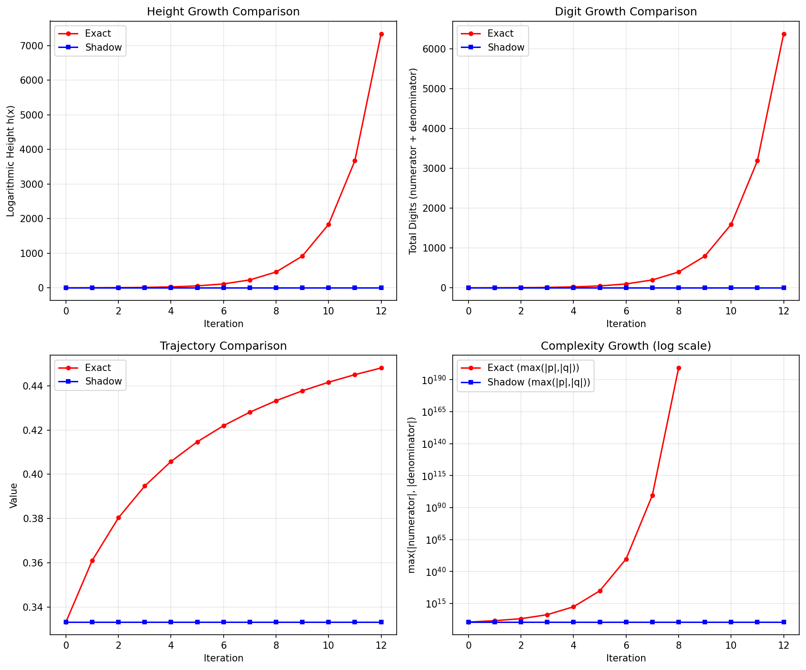

# Least-Height Shadowing

A novel algorithm for controlling height explosion in arithmetic dynamics over rational numbers.

## The Problem

When iterating rational maps over ℚ (e.g., `f(x) = x² + 1/4`), the numerators and denominators grow exponentially. After just 15 iterations, a simple fraction like `1/3` explodes to ~60,000 digits. This makes exact rational arithmetic computationally infeasible for studying dynamical systems.

```
Step 0:  1/3                          (2 digits)
Step 5:  huge/huge                    (50 digits)  
Step 10: astronomical/astronomical    (1,600 digits)
Step 15: incomprehensible            (58,000+ digits)
```

## The Solution

**Least-Height Shadowing** introduces a "damped" iteration that trades minimal precision for bounded complexity:

```
x_{n+1} = argmin_{z ∈ ℚ} [ ||f(xₙ) - z||² + λ·exp(β·h(z)) ]
```



Where:
- `h(z)` is the logarithmic height of rational `z = p/q` (roughly log of max digit count)
- `λ, β` are tunable "arithmetic friction" parameters
- The first term keeps accuracy high; the second term penalizes complexity

Instead of accepting the exact (exploding) result, we find a nearby "simple" rational.

## Results

| Metric | Exact Arithmetic | Least-Height Shadow |
|--------|------------------|---------------------|
| Height at step 15 | 58,712 | 5.5 |
| Digits | ~25,000 | 3-4 |
| Compression | — | **10,600×** |
| Max tracking error | — | 0.02% |

The shadow orbit stays bounded while tracking the true dynamics with controllable error.

## Installation

```bash
git clone https://github.com/YOUR_USERNAME/least-height-shadowing.git
cd least-height-shadowing
pip install -r requirements.txt  # just standard library + matplotlib for visualization
```

## Quick Start

```python
from fractions import Fraction
from lhs import least_height_projection, simulate

# Define your map
def f(x: Fraction) -> Fraction:
    return x * x + Fraction(1, 4)

# Run shadow iteration
x0 = Fraction(1, 3)
results = simulate(x0, steps=20, lam=1e-8, beta=0.3, f_map=f)

# Compare heights
print(f"Exact height: {results['heights_exact'][-1]:,.0f}")
print(f"Shadow height: {results['heights_shadow'][-1]:.1f}")
```

## Parameters

| Parameter | Effect | Typical Range |
|-----------|--------|---------------|
| `λ` (lambda) | Strength of height penalty | 10⁻⁶ to 10⁻⁹ |
| `β` (beta) | Sharpness of penalty curve | 0.2 to 1.0 |
| `q_max` | Maximum denominator to search | 100 to 500 |

**Tuning guide:**
- Smaller `λ` → better accuracy, higher heights allowed
- Larger `λ` → more aggressive compression, larger errors
- Larger `q_max` → better approximations, slower computation

## Theory

The algorithm exploits a fundamental tradeoff from Diophantine approximation: any real number can be approximated by rationals with error ~1/q² using only denominators up to q. The height penalty creates an "optimal" complexity level:

```
H* ≈ (1/(β+4)) · log(4/λβ)
```

This is independent of the iteration count—the shadow orbit stays in a bounded-height region forever.

**Key theoretical properties:**
1. **Existence**: Minimizers always exist (penalty dominates for large height)
2. **Bounded height**: Shadow orbit heights are bounded by H* + O(1)
3. **Eventual periodicity**: Bounded height → finite state space → periodic orbit (Northcott's theorem)

## Applications

- **Symbolic computation**: Iterate rational maps without memory blowup
- **Arithmetic dynamics research**: Compute approximate canonical heights
- **Educational**: Demonstrate height growth in number theory courses
- **Numerical analysis**: Alternative to floating-point for exact-ish rational arithmetic

## Limitations

- **Chaotic systems**: Error accumulates exponentially in Lyapunov time (unavoidable for any approximation)
- **Not exact**: This is lossy compression—use exact arithmetic if you need exact answers
- **Fixed points**: Aggressive damping can cause collapse to fixed points (tune parameters carefully)

## How It Compares

| Method | Exact? | Bounded Memory? | Error Control? |
|--------|--------|-----------------|----------------|
| Exact rational | ✓ | ✗ (explodes) | N/A |
| Floating-point | ✗ | ✓ | ✗ (accumulates) |
| Interval arithmetic | ✗ | ✓ | ✓ (intervals widen) |
| **Least-Height Shadow** | ✗ | ✓ | ✓ (tunable) |

## Citation

If you use this in research, please cite:

```bibtex
@software{least_height_shadowing,
  title={Least-Height Shadowing: Controlling Height Explosion in Arithmetic Dynamics},
  year={2025},
  url={https://github.com/r3l1c7/least-height-shadowing}
}
```

## Related Work

- Silverman, J. H. — *The Arithmetic of Dynamical Systems* (canonical heights)
- Call, G. & Silverman, J. H. — "Canonical Heights on Varieties with Morphisms"
- Vivaldi, F. et al. — Discretized dynamics and roundoff (quantized rotations)
- Wang, Q. — Least Squares Shadowing for chaotic systems

## License

MIT

## Contributing

Issues and PRs welcome. Particularly interested in:
- Canonical height variants (using ĥ_φ instead of naive height)
- Higher-dimensional implementations (using LLL for simultaneous approximation)
- Integration with SageMath/SymPy
- Better heuristics for parameter selection
